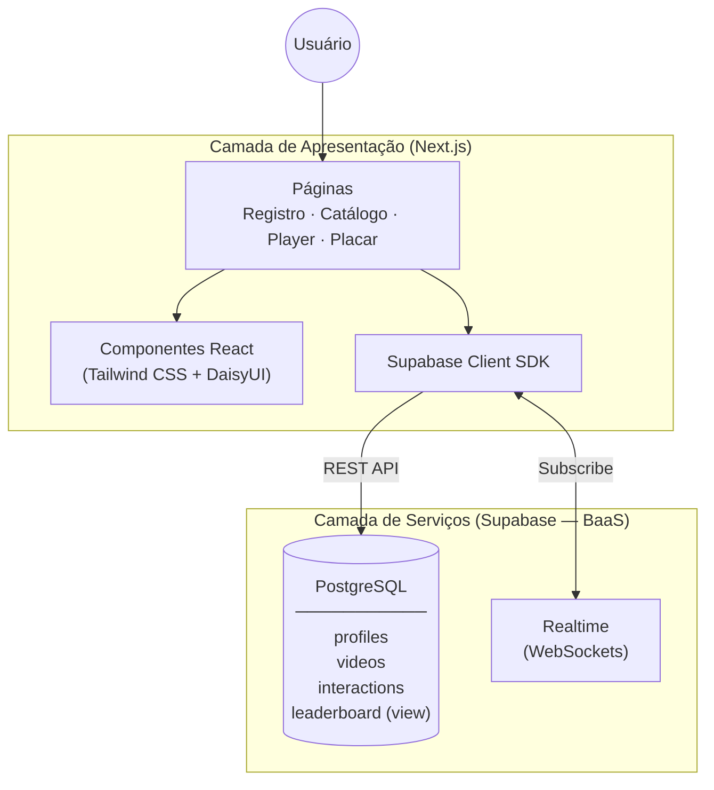
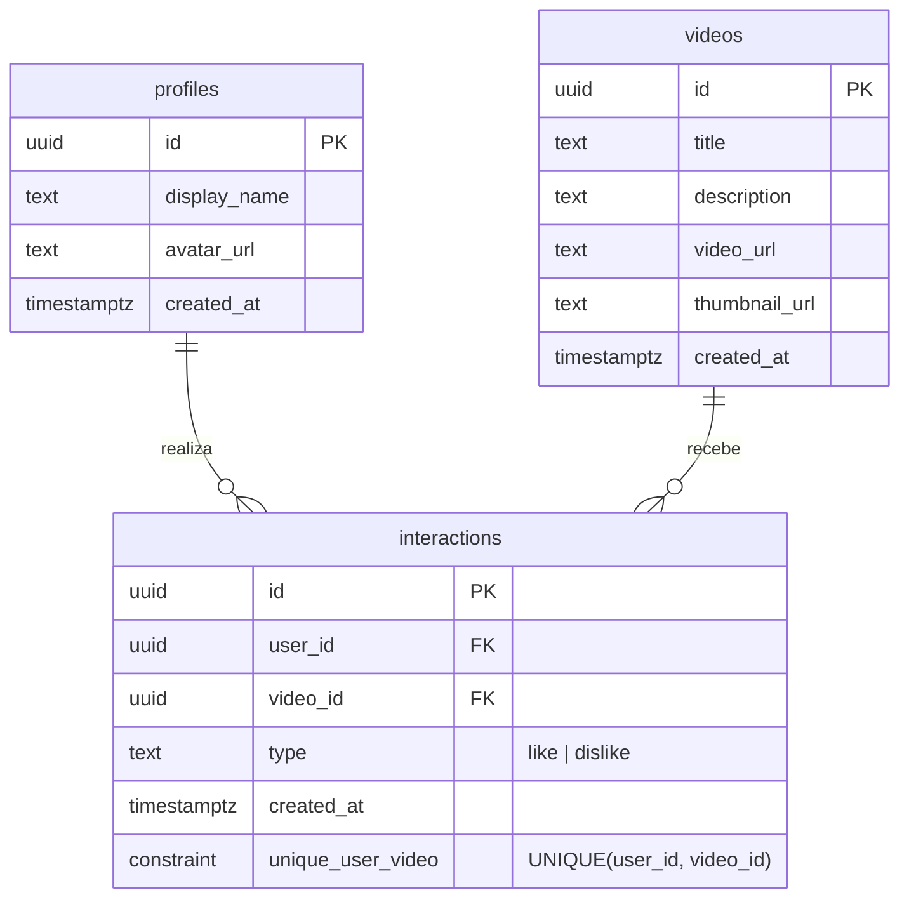

# Capítulo 4 — Desenvolvimento (Prévia para Etapa 1)

> **Instruções**: Texto para inserir no artigo como Capítulo 4.
> Os diagramas Mermaid devem ser renderizados como imagem (Figuras 2 e 3).
> Seções 4.5 será expandida na Etapa 2 com screenshots do protótipo construído.

---

## Texto do Capítulo

### 4 DESENVOLVIMENTO

Este capítulo descreve as decisões de projeto, a arquitetura do sistema, a modelagem de dados e as escolhas tecnológicas que fundamentaram o desenvolvimento do protótipo de plataforma de streaming com mecânica de placar.

### 4.1 Arquitetura do sistema

A arquitetura do protótipo seguiu o modelo cliente-servidor em duas camadas: uma camada de apresentação (front-end), responsável pela interface com o usuário, e uma camada de serviços (back-end), provida integralmente pelo Supabase. A Figura 2 apresenta a visão geral da arquitetura adotada.

Figura 2 — Arquitetura geral do protótipo

[Inserir diagrama Mermaid renderizado — ver seção "Diagramas Mermaid" abaixo]

Fonte: Elaborado pelo autor (2026).

A camada de apresentação foi desenvolvida com o framework Next.js, que estende a biblioteca React com funcionalidades de roteamento baseado em sistema de arquivos, renderização no lado do servidor (Server-Side Rendering — SSR) e otimizações automáticas de desempenho. Para a estilização, adotou-se o framework utilitário Tailwind CSS em conjunto com a biblioteca de componentes DaisyUI, que oferece componentes pré-estilizados e suporte a temas visuais configuráveis, acelerando o desenvolvimento da interface.

A camada de serviços foi provida pelo Supabase, uma plataforma de Back-end as a Service (BaaS) de código aberto construída sobre o PostgreSQL. O Supabase foi selecionado por disponibilizar, em uma plataforma integrada, duas funcionalidades essenciais ao protótipo: (a) banco de dados relacional com suporte a views e restrições de integridade; e (b) subscrições em tempo real via protocolo WebSocket, que permitem a atualização instantânea do placar. A utilização de um BaaS eliminou a necessidade de desenvolver e manter uma infraestrutura de back-end dedicada, permitindo concentrar os esforços na implementação da interface e da mecânica de gamificação.

A comunicação entre as duas camadas ocorre por meio do SDK oficial do Supabase para JavaScript (@supabase/supabase-js), que encapsula as chamadas à API REST para operações de leitura e escrita e mantém conexões WebSocket para eventos em tempo real.

### 4.2 Modelagem de dados

O modelo de dados foi projetado com foco na simplicidade, contemplando apenas as entidades necessárias para o funcionamento da plataforma e da mecânica de placar. A Figura 3 apresenta o diagrama de entidade-relacionamento.

Figura 3 — Diagrama de entidade-relacionamento do protótipo

[Inserir diagrama Mermaid renderizado — ver seção "Diagramas Mermaid" abaixo]

Fonte: Elaborado pelo autor (2026).

O modelo é composto por três tabelas e uma view:

a) profiles — armazena os dados de perfil dos usuários registrados, incluindo nome de exibição (display_name) e URL do avatar (avatar_url). Cada registro é criado no momento em que o usuário informa seu nome na tela de registro, recebendo um identificador único (UUID) gerado automaticamente pelo banco de dados. O identificador é armazenado localmente no navegador para manter a sessão do usuário.

b) videos — contém o catálogo de vídeos curtos disponíveis na plataforma, com campos para título, descrição, URL do vídeo e URL da miniatura. Os registros desta tabela são pré-carregados (seed data), simulando um acervo de conteúdo de streaming.

c) interactions — registra cada interação de avaliação realizada pelos usuários. Cada registro associa um usuário (user_id) a um vídeo (video_id) e armazena o tipo de interação (like ou dislike). Uma restrição de unicidade (UNIQUE) sobre o par (user_id, video_id) garante que cada usuário possua no máximo uma avaliação por vídeo, podendo alterá-la livremente.

d) leaderboard (view) — agregação SQL que contabiliza o total de interações por usuário e atribui uma posição no ranking. Esta abordagem evita a necessidade de manter uma tabela de pontuação separada, reduzindo a complexidade do modelo e garantindo que o ranking reflita sempre o estado atual dos dados.

### 4.3 Mecânica de placar

A mecânica de placar foi projetada para ser simples e transparente, conforme o modelo conceitual apresentado na Seção 2.5. Cada interação registrada pelo usuário — seja like ou dislike — incrementa sua contagem total de interações, que determina sua posição no ranking. O placar exibe os usuários ordenados por número total de interações, do mais ativo para o menos ativo.

A atualização do placar ocorre em tempo real por meio do recurso Realtime do Supabase. Quando qualquer usuário registra uma nova interação, um evento é propagado via WebSocket para todos os clientes conectados, que reconsultam a view de leaderboard e atualizam a exibição do ranking sem necessidade de recarregamento da página. Esse comportamento reforça o processo motivacional de feedback imediato descrito no modelo conceitual (Seção 2.5), uma vez que o usuário percebe instantaneamente a consequência de sua ação na classificação.

### 4.4 Tecnologias e ferramentas

O Quadro 1 sintetiza as tecnologias e ferramentas utilizadas no desenvolvimento do protótipo, com as respectivas justificativas de seleção.

Quadro 1 — Tecnologias e ferramentas utilizadas no protótipo

| Componente | Tecnologia | Justificativa |
|---|---|---|
| Framework front-end | Next.js (React) | Roteamento automático, renderização no servidor, ecossistema consolidado |
| Estilização | Tailwind CSS + DaisyUI | Classes utilitárias para desenvolvimento ágil; componentes e temas prontos |
| Back-end (BaaS) | Supabase | Banco de dados relacional e tempo real em plataforma única de código aberto |
| Banco de dados | PostgreSQL (via Supabase) | Suporte nativo a views e restrições de integridade |
| Assets visuais | IA Generativa | Geração rápida de miniaturas e elementos gráficos sem necessidade de acervo próprio |

Fonte: Elaborado pelo autor (2026).

A escolha do Next.js como framework de front-end justificou-se pela produtividade no desenvolvimento de aplicações React, com roteamento baseado em sistema de arquivos que elimina a necessidade de configuração manual de rotas. O Supabase foi preferido em relação a alternativas proprietárias por ser de código aberto e baseado em PostgreSQL, o que permite o uso de recursos avançados do banco relacional — como views e restrições de integridade — sem dependência de um banco de dados proprietário.

### 4.5 Interface do protótipo

A identidade visual do protótipo adotou uma paleta de cores em tons de âmbar e dourado sobre fundo escuro. Essa escolha buscou diferenciar a plataforma dos serviços de streaming comerciais, que tipicamente utilizam paletas baseadas em vermelho (Netflix, YouTube), verde (Spotify, Hulu), azul (Disney+, Amazon Prime Video) ou roxo (Twitch). A associação do dourado com conceitos de premiação e classificação reforça visualmente a temática do placar. A estilização foi implementada por meio de um tema personalizado no DaisyUI, garantindo consistência visual em todos os componentes da interface.

O protótipo é composto por quatro telas principais:

a) Tela de registro — formulário simplificado que solicita apenas o nome do participante. Essa decisão de projeto visou reduzir o atrito de entrada, facilitando o acesso ao protótipo durante a fase de avaliação. Após informar o nome, o usuário é direcionado automaticamente ao catálogo.

b) Tela de catálogo — exibe os vídeos disponíveis em formato de grade, com miniatura, título e indicadores de avaliação. O componente de placar é visível nesta tela, permitindo que o usuário acompanhe o ranking enquanto navega pelo conteúdo.

c) Tela de reprodução (player) — permite assistir ao vídeo selecionado e registrar a avaliação por meio de botões de like e dislike. Ao interagir, a pontuação do usuário no placar é atualizada instantaneamente.

d) Componente de placar — painel que exibe o ranking dos usuários mais ativos, com posição, nome de exibição, avatar e total de interações. O componente é atualizado em tempo real e pode ser visualizado tanto na tela de catálogo quanto na tela de reprodução.

A Seção 5 apresentará os resultados da avaliação do protótipo pelos usuários participantes.

---

## Diagramas Mermaid

### Figura 2 — Arquitetura geral do protótipo



### Figura 3 — Diagrama de entidade-relacionamento



---

## SQL para Supabase (referência para implementação)

> Este SQL não vai no artigo — é referência técnica para quando for construir o protótipo.

```sql
-- =============================================
-- 1. profiles (registro simplificado — apenas nome)
-- =============================================
create table public.profiles (
  id uuid default gen_random_uuid() primary key,
  display_name text not null,
  avatar_url text,
  created_at timestamptz default now()
);

-- =============================================
-- 2. videos (catálogo pré-carregado)
-- =============================================
create table public.videos (
  id uuid default gen_random_uuid() primary key,
  title text not null,
  description text,
  video_url text not null,
  thumbnail_url text,
  created_at timestamptz default now()
);

-- =============================================
-- 3. interactions (likes e dislikes)
-- =============================================
create table public.interactions (
  id uuid default gen_random_uuid() primary key,
  user_id uuid references public.profiles(id) on delete cascade not null,
  video_id uuid references public.videos(id) on delete cascade not null,
  type text check (type in ('like', 'dislike')) not null,
  created_at timestamptz default now(),
  unique (user_id, video_id)
);

-- =============================================
-- 4. leaderboard (view — não é tabela)
-- =============================================
create or replace view public.leaderboard as
select
  p.id,
  p.display_name,
  p.avatar_url,
  count(i.id)::int as total_interactions,
  rank() over (order by count(i.id) desc)::int as position
from public.profiles p
left join public.interactions i on p.id = i.user_id
group by p.id, p.display_name, p.avatar_url
order by total_interactions desc;
```

---

## Tema de Cores — Tailwind + DaisyUI

> Referência para implementação. Paleta âmbar/dourado sobre fundo escuro.

### Opção 1: Tema personalizado (recomendado)

```js
// tailwind.config.js (ou tailwind.config.ts)
module.exports = {
  content: [
    "./app/**/*.{js,ts,jsx,tsx}",
    "./components/**/*.{js,ts,jsx,tsx}",
  ],
  theme: {
    extend: {},
  },
  plugins: [require("daisyui")],
  daisyui: {
    themes: [
      {
        streamrank: {
          "primary":          "#f59e0b",   // âmbar — botões, destaques, links
          "primary-content":  "#0c0a09",   // texto sobre primary
          "secondary":        "#d97706",   // âmbar escuro — variações
          "secondary-content":"#ffffff",
          "accent":           "#fbbf24",   // dourado claro — badges, posição #1
          "accent-content":   "#0c0a09",
          "neutral":          "#292524",   // cinza quente — cards, bordas
          "neutral-content":  "#e7e5e4",
          "base-100":         "#0c0a09",   // fundo principal (quase preto)
          "base-200":         "#1c1917",   // fundo secundário
          "base-300":         "#292524",   // fundo terciário
          "base-content":     "#e7e5e4",   // texto padrão (cinza claro)
          "info":             "#38bdf8",
          "success":          "#4ade80",   // like
          "warning":          "#fb923c",
          "error":            "#f87171",   // dislike
        },
      },
    ],
  },
};
```

### Opção 2: Tema pronto do DaisyUI

O tema `luxury` do DaisyUI já usa tons dourados sobre fundo escuro.
Basta adicionar `data-theme="luxury"` no `<html>` e ajustar se necessário.

---

## Verificação de Consistência — Seção 3.2 do Artigo

> Verificar se a seção 3.2 no .doc já reflete a stack correta (Next.js + Supabase).
> O arquivo `ajustes-artigo-v5.md` ainda contém "React.js" e "LocalStorage" — se o texto
> foi copiado dele, é preciso atualizar. O texto correto para 3.2 é:

**Parágrafo 1** (substituir referência a React.js):

Para a construção do protótipo funcional, utilizou-se uma arquitetura baseada em componentes web. A interface (front-end) foi desenvolvida com o framework Next.js, que estende a biblioteca React com funcionalidades de renderização no servidor e roteamento baseado em sistema de arquivos, permitindo a criação de uma aplicação web responsiva e dinâmica. A escolha dessa tecnologia justificou-se pela sua capacidade de gerenciar o estado da aplicação em tempo real, aspecto essencial para a atualização imediata do placar conforme os usuários interagem com o conteúdo.

**Parágrafo 4** (substituir referência a LocalStorage):

A persistência dos dados de interação foi implementada por meio do Supabase, uma plataforma de Back-end as a Service (BaaS) de código aberto baseada em PostgreSQL. O Supabase provê banco de dados relacional e subscrições em tempo real via WebSocket, permitindo a centralização dos dados de interação e a atualização instantânea do placar para todos os usuários conectados.

**Parágrafo do ciclo DSR** (seção 3, parágrafo final — substituir "React.js"):

Conforme o ciclo regulador proposto por Wieringa (2014), o trabalho percorreu as seguintes etapas: (1) investigação do problema, por meio da revisão da literatura e da análise de trabalhos relacionados sobre gamificação e placares em plataformas digitais; (2) projeto da solução, com a definição do modelo conceitual e da mecânica de placar para o contexto de streaming; (3) implementação do artefato, com o desenvolvimento do protótipo funcional em Next.js com Supabase; e (4) avaliação da implementação, por meio da aplicação de questionário estruturado com usuários.
